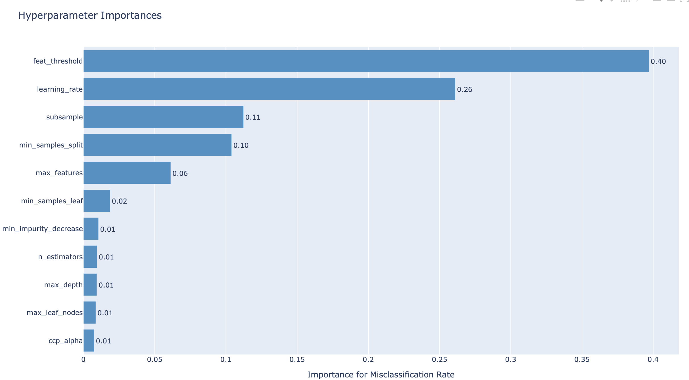

Optimizing Gradient Boosting Hyperparameters using Bayesian Optimisation

I also added untuned Gradient Boosting model to compare with tuned version

The only parameters you need to give:

| Parameter       | Description                                                                                                                           |
|-----------------|---------------------------------------------------------------------------------------------------------------------------------------|
| seed            | for reproducibility (I used 27)                                                                                                       |
| filename        | "madeline.arff" or "madelon.arff", which should be in "datasets" folder                                                               |
| time_budget     | HPO runtime (per CV fold), please give an appropriate number to obtain at least 30 iterations for madelon, 45 iterations for madeline |
| val_size_hpo    | size of the validation set over size of the train+validation set                                                                      |
| study_save_name | if you want to save the study for future provide a name, otherwise give None                                                          |

The program will print misclassification scores along with number of features used for optimization, all averaged on 10 folds
## My Experiment Results

### On Madelon

time_budget is used as 720 seconds/fold (around 350 trials/fold) and val_size_hpo is used as 0.3

| Model                     | Misclassification Rate |
|---------------------------|------------------------|
| Random Forest             | 0.280                  |
| LR+SVM+NB                 | 0.417                  |
| (extra) GB without AutoML | 0.247                  |
| AutoML                    | 0.163                  |

Relative number of features: 0.0257

### On Madeline

time_budget is used as 720 seconds/fold (around 500 trials/fold) and val_size_hpo is used as 0.3

| Model                     | Misclassification Rate |
|---------------------------|------------------------|
| Random Forest             | 0.227                  |
| LR+SVM+NB                 | 0.408                  |
| (extra) GB without AutoML | 0.224                  |
| AutoML                    | 0.149                  |

Relative number of features: 0.116

In addition, I provided the datasets in case there would be an update in the online version.
I also provided my resulting files in case you don't want to re-run

### Resulting Visualization Examples
Plot of a pareto front, also including the hypervolume plot

The importance of the HPs for Gradient Boosting on Madelon dataset

